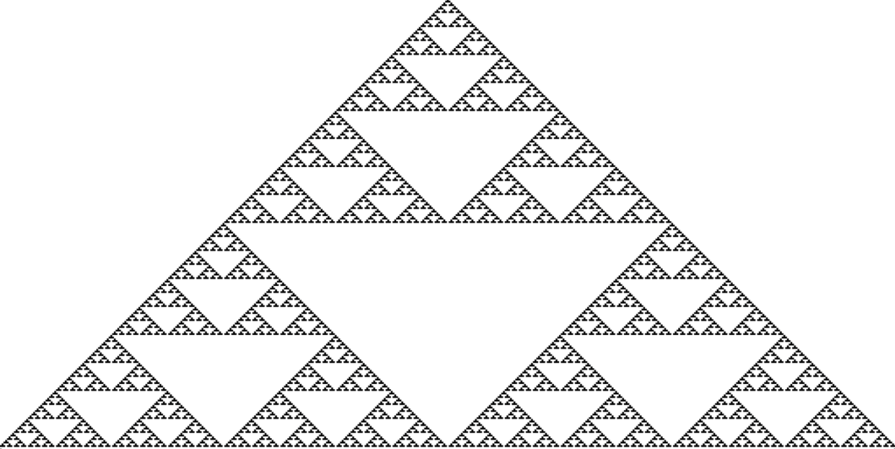

<p align="center">
  
</p>

<p align="center">
     <b>Elementary Cellular Automaton Visualizer</b>
</p>

---

This project was developed for a 3rd-year biology course at the University of
Lethbridge to demonstrate the principle of 
[emergence](https://en.wikipedia.org/wiki/Emergence).

It allows for the visualization of elementary cellular automaton, using the 
rules defined by Stephen Wolfram in his book *A New Kind of
Science*. More information about elementary cellular automaton can be found [here](http://mathworld.wolfram.com/ElementaryCellularAutomaton.html).

The website uses the static website generator [Create React App](https://github.com/facebook/create-react-app).

[View live website](https://emergence.golsteyn.ca)

## Getting Started

These instructions will get you a copy of the project up and running on your local 
machine for development and testing. See deployment for notes on how to deploy 
to a live machine.


### Installing

To install, run the following:

```
git clone https://github.com/qgolsteyn/emergence
cd emergence
yarn
```

You can then start a development server by running `yarn start`

### Deployment

Run `yarn build` and deploy the build folder on your prefered static website publisher.

## Built with

* [Create React App](https://github.com/facebook/create-react-app)
* [React](https://reactjs.org/)
* [styled-components](https://github.com/styled-components/styled-components)
* [Netlify](https://www.netlify.com)

## Authors

* **Quentin Golsteyn** - Current project maintainer

## License

This project is licensed under the MIT License - see the 
[LICENSE.md](LICENSE.md) file for details.